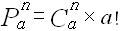

# 排列組合

## 排列與組合

組合只關心抽出來的球包含那些數字，而不管順序。`C`

排列則會關心抽出來的順序與數字。`P`

## 排列

首先先閱讀以下文章:

[http://blog.xuite.net/isdp2008am/wretch/123046101-組合學的\[剩餘定理\]](http://blog.xuite.net/isdp2008am/wretch/123046101-組合學的[剩餘定理])

1. 有n個人要排隊，有幾種排法?

```text
n!
```

2.有n個人從中取出a人來排隊。

```text
n * n-1 * n-2 ..... n-a+2 * n-a+1
```

> 最後面為n-a+1，原因是前面已經有a個位置排好的\(n-a\)，然後至少會剩一個位置\(+1\)
>
> 第a個座位有（n－a＋1）種選法，帶入數字即可
>
> 此及為所謂的n取a之排列數範例，一般使用P表示

所以上面１號公式 - 比２號會多出了（n-a）!，因為二號公式如果沒有位置限制的話後面還會多出如下

```text
n-a * n-a-1 * n-a-2 ..... = (n-a)!
```

所以就可以推導得到

```text
P（ｎ, a） = n! / (n-a)!
```

> 可參考：[https://wenku.baidu.com/view/9f6dadd2d15abe23482f4df2.html](https://wenku.baidu.com/view/9f6dadd2d15abe23482f4df2.html)

## 組合

> 比排列\(P\) 少了取出後排列的排列部分，損以不管順序，可以除以P（ｎ, a）的a的部分
>
> 所以 C\(n , a\) = P \(n, a\) / a!

一般用C來表示，有n個人從中取出a人來，然後將其分組，有如下關係。

\(1\)n人取a人排列，a≦n，方法數為`「P, n取a」`

\(2\)n人取a人組合，a≦n，方法數為`「C, n取a」`

\(3\)a個人任意排列，方法數為`a！`



> 所以可以推導為如上公式，因為將組合後的C乘上任意排列的a!，及為取出但尚為排列的P


## 其他題型

[https://www.youtube.com/watch?v=jQs75DaeqOE](https://www.youtube.com/watch?v=jQs75DaeqOE)

